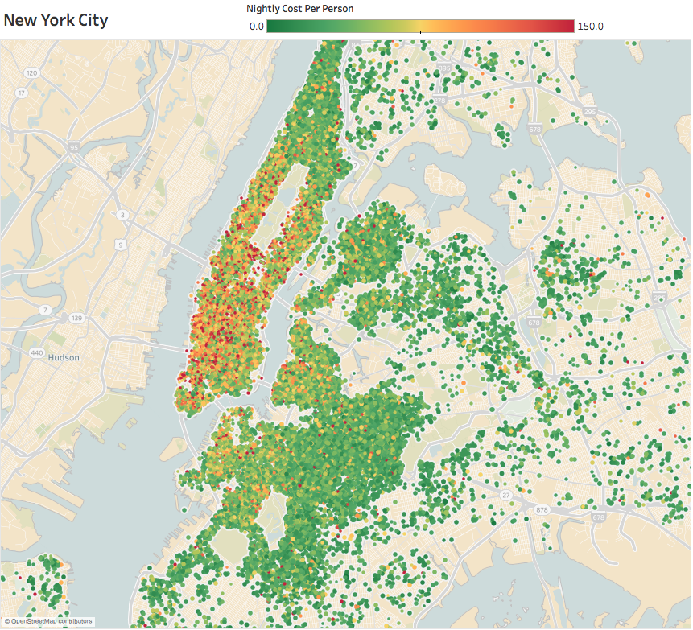

# Airbnb Listing Recommendations
### Utilizing Natural Language Processesing for Engineering Model Features

[Preparing Data and EDA - Clean_EDA](notebooks/Clean_EDA.ipynb)  
[Recommendation System - Recommender](notebooks/Recommender.ipynb)  
[Slides - Abnb-Rec](abnb-rec.pdf)

### Overview:
I built a content-based recommendation engine utilizing Natural Language Processing as a baseline to help connect end-users to a desired destination in order to speed the sales cycle and improve customer satisfaction.

### Data:
Thanks to Murray Cox at insideairbnb.com, I was able to look at almost 100,000 current (2018 Q1) Airbnb listings from New York City (48,600+), Sydney (32,700), New Orleans (5,200), San Francisco (~4,800), and Portland (4,700). The data came in 96 columns which were compartmentalized as listing text and host text descriptors, numeric host data, listing details (i.e. pricing, amenities, reviews, etc.), numeric reviews, and calendar data. I mainly used the text descriptions and listing details, but could easily plug and play any feature provided.

An interesting bit I looked at was the host count and the listing count per host. Two-thirds (2/3) of all listings are from owners with 5 or more listings, whereas two-thirds of all hosts list only one listing. 2 specific hosts were identified to have 180 listings each!

### Recommender
Utilizing Gensim's Latent Semantic Indexing (LSI) model, I created 2 similarity scores based on the listing text and the host text descriptors. The NLP components helps find latent variables a user would be interested in, for example a host with a flowery personality as opposed to an older host with no patience for a rowdy guest. I use the haversine distance formula to calculate distances between listings. I assumed the anonymization methods on location data were random, independent and identically distributed, so the distances are a fair calculation to use and only presents mild bias to the recommendations. To keep things appropriate, filters were used such as minimum number of guests accommodated, and upcoming availability. Beds, prices, a business friendly flag, and a flag for instant bookable listings were combined with the engineered text features. These selected features were put in a comparable space with a uniform quantile transformer and then reweighted with user input. A user form asks which features they want the system to consider more/ less when making a decision for the k nearest neighbors.

 - Are you interested in finding a similar listing based on the description? (Y/N)
 - Are you interested in finding a similar listing based on this host? (Y/N)
 - Is this a business trip? (Y/N)
 - How important is the price? Rate [1-5]
    - 1 means you can explore other prices.
    - 5 means you found the price you want!
 - How important is the location? Rate [1-5]
    - 1 means you are open to other neighborhoods
    - 5 means you want to stay close!

Please see the [Slides](abnb-rec.pdf) for an example!

### Conclusion
This simple system responds well to the changes in input form. There are many things that I would like to do to improve this. First I would try finding more information in the pictures using convolutional nueral networks to understand the stylistic components or the tone of the house interior. I would prefer tracking user behavior on every page to understand what aspects are most important to each individual to learn weights implicitly so we would not have the bother the user.

